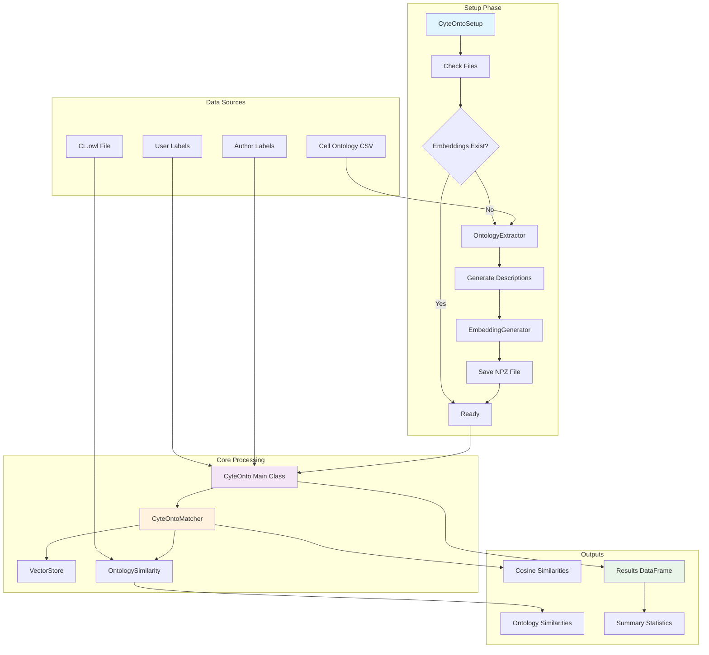

# CyteOnto

A library utilizing LLMs and Cell Ontology to quantify the similarity and meaningfulness between cell annotations. When benchmarking a new algorithm for annotations, CyteOnto helps measure how close the predicted annotations are to the original annotations provided by authors, using cell ontology as reference.

## 🎯 Features

- **Automated Setup**: Generates descriptions for all Cell Ontology terms and creates vector embeddings
- **Smart Caching**: Uses NPZ files for efficient embedding storage with naming convention `CO_<text-model>_<embedding-model>.npz`
- **Dual Similarity Metrics**: 
  - **Cosine Similarity**: For semantic similarity between embeddings
  - **Ontology Hierarchy Similarity**: Using Cell Ontology structure and relationships
- **Batch Processing**: Efficiently compare multiple algorithms against reference annotations
- **AnnData Integration**: Direct support for single-cell analysis workflows
- **Modular Design**: Use individual components (setup, matcher, etc.) as needed

## 🚀 Quick Start

### Installation

```bash
# Clone the repository
git clone <repository-url>
cd CyteOnto

# Install with uv (recommended)
uv sync
```

### Basic Usage

```python
import asyncio
from cyteonto import CyteOnto
from pydantic_ai import Agent
from pydantic_ai.models import xai

async def main():
    # 1. Initialize CyteOnto
    cyteonto = CyteOnto(
        text_model="grok-3-mini",
        embedding_model="Qwen/Qwen3-Embedding-8B",
        embedding_provider="deepinfra"
    )
    
    # 2. Setup embeddings (first time only)
    model = xai.XAIModel("grok-3-mini")
    agent = Agent(model, name="cell_descriptor")
    
    success = await cyteonto.setup_embeddings(
        base_agent=agent,
        generate_embeddings=True
    )
    
    # 3. Compare annotations
    author_labels = ["T cells", "B cells", "NK cells"]
    algorithm_labels = ["T lymphocytes", "B lymphocytes", "NK cells"]
    
    cosine_sims, ontology_sims = await cyteonto.compare_single_pair(
        author_labels=author_labels,
        algorithm_labels=algorithm_labels,
        base_agent=agent
    )
    
    print(f"Cosine similarities: {cosine_sims}")
    print(f"Ontology similarities: {ontology_sims}")

# Run the example
asyncio.run(main())
```

## 📋 Setup Phase

CyteOnto automatically handles a comprehensive setup phase:

1. **File Validation**: Checks for required ontology files (`cl.owl`, `cell_to_cell_ontology.csv`)
2. **Description Generation**: Creates detailed descriptions for all Cell Ontology terms using LLM
3. **Embedding Creation**: Generates embeddings for descriptions using specified embedding model
4. **Smart Caching**: Saves to NPZ format for fast retrieval: `CO_grok-3-mini_Qwen3-Embedding-8B.npz`

### Setup Options

```python
# Quick setup (generate only if missing)
await cyteonto.setup_embeddings(base_agent, generate_embeddings=True)

# Force regeneration
await cyteonto.setup_embeddings(base_agent, force_regenerate=True)

# Check setup status
info = cyteonto.get_setup_info()
print(f"Ready: {info['ready']}")
```

## 🔍 Similarity Matching

### Cosine Similarity Matching

Uses semantic embeddings to find closest Cell Ontology terms:

```python
from cyteonto import CyteOntoMatcher

matcher = CyteOntoMatcher(embeddings_file_path=embeddings_path)

# Find closest ontology terms
matches = matcher.find_closest_ontology_terms(
    query_embeddings=user_embeddings,
    top_k=5,
    min_similarity=0.3
)

# Get best match for single query
best_match = matcher.find_best_ontology_match(
    query_embedding=single_embedding,
    min_similarity=0.1
)
```

### Ontology Hierarchy Similarity

Computes similarity based on Cell Ontology structure and relationships:

```python
# Compare using ontology hierarchy
similarities = matcher.compute_ontology_similarity(
    author_labels=["T cells", "B cells"],
    user_labels=["T lymphocytes", "Plasma cells"]
)

# Direct ontology ID comparison
similarities = matcher.compute_pairwise_ontology_similarities(
    author_ontology_ids=["CL:0000084", "CL:0000236"], 
    user_ontology_ids=["CL:0000084", "CL:0000786"]
)
```

## 📊 Batch Processing

### Multiple Algorithm Comparison

```python
# Compare multiple algorithms at once
comparison_data = [
    ("Algorithm_1", author_labels, algo1_labels),
    ("Algorithm_2", author_labels, algo2_labels),
    ("Algorithm_3", author_labels, algo3_labels),
]

results_df = await cyteonto.compare_batch(
    comparison_data=comparison_data,
    base_agent=agent,
    use_descriptions=True
)

# Get summary statistics
summary = cyteonto.compute_summary_statistics(results_df)
```

### AnnData Integration

Direct support for single-cell analysis workflows:

```python
# Compare algorithms across AnnData objects
results_df = await cyteonto.compare_anndata_objects(
    anndata_objects=[adata1, adata2],
    target_columns=['leiden_clusters', 'seurat_clusters'],
    author_column='cell_type_manual',
    algorithm_names=['Leiden', 'Seurat'],
    base_agent=agent
)
```

## 🏗 Architecture

### Core Components

- **CyteOnto**: Main orchestrator class for batch processing
- **CyteOntoSetup**: Handles setup phase and file management
- **CyteOntoMatcher**: Provides similarity matching capabilities
- **VectorStore**: Manages NPZ embedding storage/retrieval
- **OntologyExtractor**: Processes Cell Ontology mappings
- **EmbeddingGenerator**: Creates embeddings for cell descriptions

### File Structure

```
cyteonto/
├── storage/           # Vector storage and file utilities
├── ontology/          # Cell ontology processing  
├── pipeline/          # Description and embedding generation
├── matcher/           # Similarity matching
├── data/
│   ├── cell_ontology/ # Cell Ontology files
│   └── embedding/     # Generated embeddings and descriptions
└── main.py           # Main CyteOnto class
```

## ⚙️ Configuration

Set environment variables in `.env`:

```bash
# LLM Configuration
TEXT_MODEL="grok-3-mini"
TEXT_MODEL_API_KEY="your_xai_api_key"
TEXT_MODEL_PROVIDER="xai"

# Embedding Configuration  
EMBEDDING_MODEL="Qwen/Qwen3-Embedding-8B"
EMBEDDING_MODEL_API_KEY="your_deepinfra_token"
EMBEDDING_MODEL_PROVIDER="deepinfra"

# Optional
NCBI_API_KEY="your_ncbi_key"  # For PubMed abstracts
LOGFIRE_API_KEY="your_logfire_key"  # For logging
```

### Supported Providers

- **LLM Models**: XAI (Grok), OpenAI, others via pydantic-ai
- **Embedding Models**: DeepInfra, OpenAI, Google, Ollama

## 🔧 Advanced Usage

### Custom Embedding Paths

```python
from pathlib import Path

cyteonto = CyteOnto(
    embeddings_file_path=Path("custom/path/to/embeddings.npz")
)
```

### Component-Level Usage

```python
# Use individual components
from cyteonto.storage import VectorStore
from cyteonto.ontology import OntologyExtractor

vector_store = VectorStore()
extractor = OntologyExtractor(mapping_csv_path)
```

### Model Configuration

```python
from cyteonto import EMBDModelConfig

# Custom embedding configuration
embd_config = EMBDModelConfig(
    provider="deepinfra",
    model="Qwen/Qwen3-Embedding-8B", 
    apiKey="your_key",
    maxConcEmbed=20  # Concurrent requests
)
```

## 📈 Results Format

### Comparison Results DataFrame

```python
# Columns in results_df:
- algorithm: Algorithm name
- author_label: Reference cell type label
- algorithm_label: Predicted cell type label  
- cosine_similarity: Embedding-based similarity (0-1)
- ontology_similarity: Hierarchy-based similarity (0-1)
- pair_index: Index of the comparison pair
```

### Summary Statistics

```python
# Summary statistics per algorithm:
- mean_cosine_similarity: Average cosine similarity
- std_cosine_similarity: Standard deviation
- min/max_cosine_similarity: Range
- mean_ontology_similarity: Average ontology similarity
- count_cosine_similarity: Number of comparisons
```

## 🧪 Example Use Cases

1. **Algorithm Benchmarking**: Compare multiple clustering/annotation algorithms
2. **Cross-Study Validation**: Evaluate annotation consistency across datasets  
3. **Quality Control**: Assess annotation quality using ontology relationships
4. **Method Development**: Test new cell type annotation approaches

## 🤝 Contributing

CyteOnto uses a modular architecture making it easy to extend:

- Add new similarity metrics in `matcher/`
- Support new embedding providers in `llm_config.py`
- Extend ontology processing in `ontology/`

## 📜 License

[Your License Here]

## 🙋 Support

For questions and support:
- Check the example usage in `example_usage.py`
- Review the comprehensive docstrings in each module
- Open issues on the repository

---

**CyteOnto**: Making cell type annotation comparison ontologically meaningful! 🧬✨

## Mermaid

