# 🧬 CyteOnto

**A powerful AI-driven toolkit for quantifying cell type annotation similarity using Large Language Models and Cell Ontology**

CyteOnto helps researchers benchmark cell type annotation algorithms by measuring how closely predicted annotations align with reference annotations, leveraging the structured knowledge of Cell Ontology (CL) and advanced AI techniques.

[](https://python.org)
[](LICENSE)
[](https://pydantic-ai.docs.pydantic.dev/)

---

## 🎯 Key Features

### 🤖 **AI-Powered Description Generation**
- **LLM Integration**: Uses state-of-the-art language models to generate rich, contextual descriptions of cell types
- **PubMed Integration**: Automatically incorporates scientific literature for accurate descriptions
- **Structured Output**: Generates comprehensive cell descriptions with function, markers, and disease relevance

### 📐 **Advanced Similarity Metrics**
- **Embedding Similarity**: Cosine similarity between semantic embeddings
- **Ontology Hierarchy Similarity**: Leverages Cell Ontology structure and relationships
- **Dual-Method Analysis**: Combines both approaches for comprehensive comparison

### 🗂️ **Study Organization**
- **Multi-Study Support**: Organize comparisons by study/dataset for clean separation
- **Intelligent Caching**: Study-specific caches prevent file collisions
- **Cross-Study Analysis**: Easy comparison of algorithm performance across datasets

### ⚡ **Performance & Scalability**
- **Smart Caching**: NPZ/JSON caching system with metadata validation
- **Batch Processing**: Efficient comparison of multiple algorithms simultaneously
- **Async Processing**: Non-blocking operations with progress tracking
- **Memory Efficient**: Optimized for large-scale comparisons

---

## 🚀 Installation

### Prerequisites
- Python 3.12+
- UV package manager (recommended)

### Quick Install
```bash
# Clone the repository
git clone <repository-url>
cd CyteOnto

# Install with UV
uv sync
```

### Environment Variables
```bash
# Required for AI models
DEEPINFRA_API_KEY=your_deepinfra_api_key_here   # for using deepinfra provided models
GROQ_API_KEY=your_groq_api_key_here             # for using groq provided models
OPENROUTER_API_KEY=your_groq_api_key_here       # for using openrouter provided models
OPENAI_API_KEY=your_openai_api_key_here         # for using openai models
GOOGLE_API_KEY=your_google_api_key_here         # for using gemini models
XAI_API_KEY=your_xai_api_key_here               # for using grok-3, grok-4, etc.

# Embedding model
# NOTE: by default we are using deepinfra as embedding model provider.
EMBEDDING_MODEL_API_KEY=your_deepinfra_api_key_here

# Optional: for higer rate limits
NCBI_API_KEY=your_ncbi_api_key_here             # for using pubmed tool calls
LOGFIRE_API_KEY=your_logfire_api_key_here       # for telemetry data
```

We used `deepinfra` as model to generate descriptions and embeddings. You can check out the models [here](https://deepinfra.com/models).

---

## 🔄 Workflow

```mermaid
flowchart TD
    A["📊 Input: Cell Labels"] --> B["🤖 LLM Description Generation"]
    B --> C["📐 Embedding Generation"]
    C --> D["🎯 Ontology Matching"]
    D --> E["🧮 Similarity Calculation"]
    E --> F["📈 Results & Analysis"]
    
    B --> B1["💾 Cache Descriptions<br/>(JSON)"]
    C --> C1["💾 Cache Embeddings<br/>(NPZ)"]
    D --> D1["🔗 Cell Ontology<br/>(OWL)"]
    
    G["⚙️ Setup Process"] --> H["📚 Load Cell Ontology"]
    H --> I["🤖 Generate Descriptions<br/>for All CL Terms"]
    I --> J["📐 Create Embeddings<br/>for All CL Terms"] 
    J --> K["💾 Save Base Cache"]
    
    L["🏥 Study Organization"] --> M["📁 study1/"]
    L --> N["📁 study2/"]
    L --> O["📁 study3/"]
    M --> M1["📂 author/"]
    M --> M2["📂 algorithms/"]
    N --> N1["📂 author/"]
    N --> N2["📂 algorithms/"]
    
    style A fill:#e1f5fe
    style F fill:#e8f5e8
    style G fill:#fff3e0
    style L fill:#f3e5f5
```



---

## ⚡ Quick Start

### 0. Precomputed Cell Ontology Descriptions and Embeddings

We have already computed cell ontology descriptions using `DeepSeek-V3` and embeddings using `Qwen3-Embedding-8B` models. 

To download and store at appropriate folder use the following command:

```bash
cd CyteOnto
mkdir -p cyteonto/data/embedding/descriptions
mkdir -p cyteonto/data/embedding/cell_ontology

# Kimi-K2 (Recommended)
wget -O cyteonto/data/embedding/descriptions/descriptions_moonshotai-Kimi-K2-Instruct.json https://pub-d8bf3af01ebe421abded39c4cb33d88a.r2.dev/cyteonto/descriptions/descriptions_moonshotai-Kimi-K2-Instruct.json
wget -O cyteonto/data/embedding/cell_ontology/embeddings_moonshotai-Kimi-K2-Instruct_Qwen-Qwen3-Embedding-8B.npz https://pub-d8bf3af01ebe421abded39c4cb33d88a.r2.dev/cyteonto/embeddings/embeddings_moonshotai-Kimi-K2-Instruct_Qwen-Qwen3-Embedding-8B.npz

# DeepSeek-V3
wget -O cyteonto/data/embedding/descriptions/descriptions_deepseek-ai-DeepSeek-V3.json https://pub-d8bf3af01ebe421abded39c4cb33d88a.r2.dev/cyteonto/descriptions/descriptions_deepseek-ai-DeepSeek-V3.json    
wget -O cyteonto/data/embedding/cell_ontology/embeddings_deepseek-ai-DeepSeek-V3_Qwen-Qwen3-Embedding-8B.npz https://pub-d8bf3af01ebe421abded39c4cb33d88a.r2.dev/cyteonto/embeddings/embeddings_deepseek-ai-DeepSeek-V3_Qwen-Qwen3-Embedding-8B.npz 

# DeepSeek-V3.1
wget -O cyteonto/data/embedding/descriptions/descriptions_deepseek-ai-DeepSeek-V3.1.json https://pub-d8bf3af01ebe421abded39c4cb33d88a.r2.dev/cyteonto/descriptions/descriptions_deepseek-ai-DeepSeek-V3.1.json
wget -O cyteonto/data/embedding/cell_ontology/embeddings_deepseek-ai-DeepSeek-V3.1_Qwen-Qwen3-Embedding-8B.npz https://pub-d8bf3af01ebe421abded39c4cb33d88a.r2.dev/cyteonto/embeddings/embeddings_deepseek-ai-DeepSeek-V3.1_Qwen-Qwen3-Embedding-8B.npz
```

This will download the embeddings and descriptions in correct lodation for cyteonto.

You will also need to download the cell ontology:
```bash
mkdir -p cyteonto/data/cell_ontology
wget -O cyteonto/data/cell_ontology/cell_to_cell_ontology.csv https://pub-d8bf3af01ebe421abded39c4cb33d88a.r2.dev/cyteonto/cell_ontology/cell_to_cell_ontology.csv
wget -O cyteonto/data/cell_ontology/cl.owl https://pub-d8bf3af01ebe421abded39c4cb33d88a.r2.dev/cyteonto/cell_ontology/cl.owl
```

This will download `cell_to_cell_ontology.csv` and `cl.owl` and save them in appropriate folder. 


### 1. Basic Setup

You can follow the tutorial in [tutorial.ipynb](./tutorial/tutorial.ipynb) 

```python
import cyteonto
import os
from pydantic_ai import Agent
from pydantic_ai.models.openai import OpenAIModel
from pydantic_ai.providers.openai import OpenAIProvider

# Initialize your LLM agent
model = OpenAIModel(
    "deepseek-ai/DeepSeek-V3",
    provider=OpenAIProvider(
        base_url="https://api.deepinfra.com/v1/openai",
        api_key=os.getenv("DEEPINFRA_API_KEY"),
    ),
)
agent = Agent(model)

# One-time setup: Generate ontology embeddings
# If you have downloaded and stored the embeddings file in correct location, 
# this step will only perform file checks
await cyteonto.setup(
    base_agent=agent,
    embedding_model="Qwen/Qwen3-Embedding-8B",
    embedding_provider="deepinfra",
)
```


If you have hosted your models locally, you can use `ollama` as your provider. Checkout out [Pydantic AI's Model](https://ai.pydantic.dev/models/) page for additional information regarding model providers.

> The description and embedding generarion step will be skipped if the files are already present for the given models. Look "File Organization" below for how the files are stored.

### 2. Initialize CyteOnto
```python
# Create CyteOnto instance
cyto = cyteonto.CyteOnto(
    base_agent=agent,
    embedding_model="Qwen/Qwen3-Embedding-8B", 
    embedding_provider="deepinfra"
)
```

### 3. Compare Cell Type Annotations
```python
# Your data
author_labels = ["animal stem cell", "BFU-E", "CFU-M", "neutrophilic granuloblast"]
algorithm1_labels = ["stem cell", "blast forming unit erythroid", "erythroid stem cell", "spermatogonium"]
algorithm2_labels = ["neuronal receptor cell", "stem cell", "smooth muscle cell", "ovum"]

# Perform batch comparison
results_df = await cyto.compare_batch(
    author_labels=author_labels,
    algo_comparison_data=[
        ("CellTypist", algorithm1_labels),
        ("Scanpy", algorithm2_labels)
    ],
    study_name="liver_dataset_2024"  # Organize by study
)
# The above step will generate descriptions and embeddings for author and algorithm labels,
# map to closest ontology term and 
# compute ontology-based similarity

print(results_df)
```

### 4. Analyze Results
```python
# Detailed results with all information
print("\n🔍 Detailed Results:")
print(results_df[['study_name', 'algorithm', 'author_label', 'algorithm_label', 
                 'similarity_method', 'ontology_hierarchy_similarity']].head())

# Summary statistics
print("\n📊 Algorithm Performance:")
performance = results_df.groupby('algorithm')['ontology_hierarchy_similarity'].agg(['mean', 'std', 'count'])
print(performance)

# Method breakdown
print("\n🔬 Similarity Methods Used:")
print(results_df['similarity_method'].value_counts())
```

---

## 📊 Example Output

### Detailed Comparison Results
```
     study_name    algorithm  pair_index         author_label              algorithm_label
0  liver_dataset_2024  CellTypist          0     animal stem cell                    stem cell
1  liver_dataset_2024  CellTypist          1                BFU-E  blast forming unit erythroid
2  liver_dataset_2024    Scanpy          0     animal stem cell      neuronal receptor cell

  author_ontology_id  author_embedding_similarity algorithm_ontology_id  algorithm_embedding_similarity
0         CL:0000548                       0.8234            CL:0000034                          0.7891
1         CL:0000558                       0.9156            CL:0000558                          0.9876
2         CL:0000548                       0.8234            CL:0000101                          0.7234

   ontology_hierarchy_similarity     similarity_method
0                          0.7502    ontology_hierarchy
1                          1.0000    ontology_hierarchy
2                          0.4521    ontology_hierarchy
```

### Performance Summary
```
Algorithm Performance:
               mean       std  count
algorithm                          
CellTypist   0.8751    0.1245      4
Scanpy       0.6572    0.2134      4

Similarity Methods Used:
ontology_hierarchy    7
string_similarity     1
partial_match        0
no_matches           0
```

---

## 🗂️ File Organization

CyteOnto automatically organizes your files for optimal caching and study management:

```
cyteonto/data/
├── cell_ontology/
│   ├── cl-basic.owl                            # Cell Ontology file
│   └── cell_to_cell_ontology.csv               # Ontology mappings
├── embedding/
│   ├── cell_ontology/
│   │   └── embeddings_Qwen-Qwen3-235B_Qwen-Qwen3-Embedding-8B.npz
│   └── descriptions/
│       └── descriptions_Qwen-Qwen3-235B.json
└── user_files/
    ├── embeddings/
    │   ├── liver_dataset_2024/                 # Study-specific organization
    │   │   ├── author/
    │   │   │   └── author_embeddings_*.npz
    │   │   └── algorithms/
    │   │       ├── CellTypist_embeddings_*.npz
    │   │       └── Scanpy_embeddings_*.npz
    │   └── brain_dataset_2024/
    │       ├── author/
    │       └── algorithms/
    └── descriptions/
        ├── liver_dataset_2024/
        └── brain_dataset_2024/
```

---

## 🔧 Advanced Usage

### Multi-Study Comparison
```python
# Compare same algorithms across different studies
studies = [
    ("healthy_liver", healthy_author_labels, [("CellTypist", healthy_algo1), ("Scanpy", healthy_algo2)]),
    ("diseased_liver", diseased_author_labels, [("CellTypist", diseased_algo1), ("Scanpy", diseased_algo2)]),
    ("lung_tissue", lung_author_labels, [("CellTypist", lung_algo1), ("Scanpy", lung_algo2)])
]

all_results = []
for study_name, author_labels, algo_data in studies:
    study_results = await cyto.compare_batch(
        author_labels, algo_data, study_name=study_name
    )
    all_results.append(study_results)

# Combine all studies for cross-study analysis
combined_df = pd.concat(all_results, ignore_index=True)

# Analyze algorithm consistency across studies
consistency = combined_df.pivot_table(
    index=['author_label', 'algorithm_label'],
    columns='study_name',
    values='ontology_hierarchy_similarity'
)
print("Algorithm consistency across studies:")
print(consistency.describe())
```

## 🛠️ Custom Configuration
```python
# Custom paths and settings
cyto = cyteonto.CyteOnto(
    base_agent=agent,
    embedding_model="text-embedding-ada-002",
    embedding_provider="openai",
    base_data_path="/custom/path/to/data",           # Custom data location
    user_data_path="/custom/path/to/user/files",    # Custom user files location
    enable_user_file_caching=True                    # Enable/disable caching
)
```

### Cache Management
```python
# Get cache statistics
cache_stats = cyto.get_cache_stats()
print(f"Total cached files: {cache_stats['total_files']}")
print(f"Total cache size: {cache_stats['total_size_mb']:.2f} MB")

# Cleanup invalid cache files
removed_count = cyto.cleanup_user_cache()
print(f"Cleaned up {removed_count} invalid cache files")

# Package-level cache cleanup
removed_count = cyteonto.cleanup_cache(user_data_path="/path/to/user/files")
print(f"Cleaned up {removed_count} files globally")
```

---

## 📈 Understanding Results

### Similarity Methods
- **`ontology_hierarchy`**: Both labels matched to valid CL terms, similarity computed using ontology structure
- **`string_similarity`**: One or both labels matched to non-CL terms, using embedding similarity
- **`partial_match`**: Only one label found a valid ontology match
- **`no_matches`**: Neither label found an ontology match

### Column Definitions
- **`author_ontology_id`**: Cell Ontology ID matched to author label (e.g., "CL:0000548")
- **`author_embedding_similarity`**: Similarity score between author label and its matched ontology term
- **`algorithm_ontology_id`**: Cell Ontology ID matched to algorithm label
- **`algorithm_embedding_similarity`**: Similarity score between algorithm label and its matched ontology term
- **`ontology_hierarchy_similarity`**: Final similarity between the two ontology terms (main metric)
- **`similarity_method`**: Method used for computing final similarity

### Interpretation Guidelines
- **Scores > 0.8**: High similarity, algorithm label closely matches author intention
- **Scores 0.6-0.8**: Moderate similarity, related cell types but some differences
- **Scores < 0.6**: Low similarity, significant differences in cell type interpretation

---

## 🔍 Troubleshooting

### Common Issues

#### Setup Fails with Description Errors
```bash
# Error: Description Error: 'data'
```
**Solution**: Ensure you're using compatible model versions and check API connectivity.

#### ParseError during Setup
```bash
# Error: ParseError: syntax error: line 1, column 0
```
**Solution**: The LLM is not returning valid JSON. Try a different model or check your API configuration.

#### Connection Errors
```bash
# Error: ConnectionError: HTTPSConnectionPool...
```
**Solution**: Check your internet connection and API keys. CyteOnto gracefully handles PubMed API failures.

#### Memory Issues with Large Datasets
**Solution**: Process data in smaller batches or increase system memory. Use `study_name` parameter to organize large comparisons.

### Debug Mode
```python
import logging
logging.basicConfig(level=logging.INFO)

# CyteOnto will now show detailed progress information
await cyto.compare_batch(author_labels, algo_data, study_name="debug_run")
```

---

## 📚 API Reference

### Core Classes

#### `CyteOnto`
Main class for performing cell type comparisons.

```python
class CyteOnto:
    def __init__(
        self,
        base_agent: Agent,
        embedding_model: str,
        embedding_provider: str,
        base_data_path: str | None = None,
        user_data_path: str | None = None,
        enable_user_file_caching: bool = True,
    )
    
    @classmethod
    async def with_setup(cls, ...) -> "CyteOnto"
    
    async def compare_batch(
        self,
        author_labels: list[str],
        algo_comparison_data: list[tuple[str, list[str]]],
        study_name: str | None = None,
    ) -> pd.DataFrame
    
    def get_cache_stats(self) -> dict[str, Any]
    def cleanup_user_cache(self) -> int
```

### Utility Functions

#### Setup Functions
```python
async def setup(
    base_agent: Agent,
    embedding_model: str,
    embedding_provider: str,
    base_data_path: str | None = None,
    embeddings_path: str | None = None,
    force_regenerate: bool = False,
) -> bool

async def quick_setup(
    model_name: str = "deepseek-ai/DeepSeek-V3",
    embedding_model: str = "Qwen/Qwen3-Embedding-8B",
    provider: str = "deepinfra",
    api_key: str | None = None,
) -> bool

def cleanup_cache(user_data_path: str | None = None) -> int
```

---

## 🤝 Contributing

We welcome contributions! Please see our contribution guidelines for details.

### Development Setup
```bash
git clone <repository-url>
cd CyteOnto
uv sync --dev
pre-commit install
```
<!-- 
### Running Tests
```bash
uv run pytest tests/
uv run pytest tests/ -v --cov=cyteonto
``` -->

---

## 📄 License

This project is licensed under the MIT License - see the [LICENSE](LICENSE) file for details.

---

## Acknowledgments

- **Cell Ontology (CL)**: For providing the structured vocabulary for cell types
- **Pydantic AI**: For the excellent AI agent framework
- **The Open Biomedical Ontologies**: For maintaining high-quality biological ontologies

---

*CyteOnto - Bridging AI and Cell Biology for Better Annotations* 🧬✨
