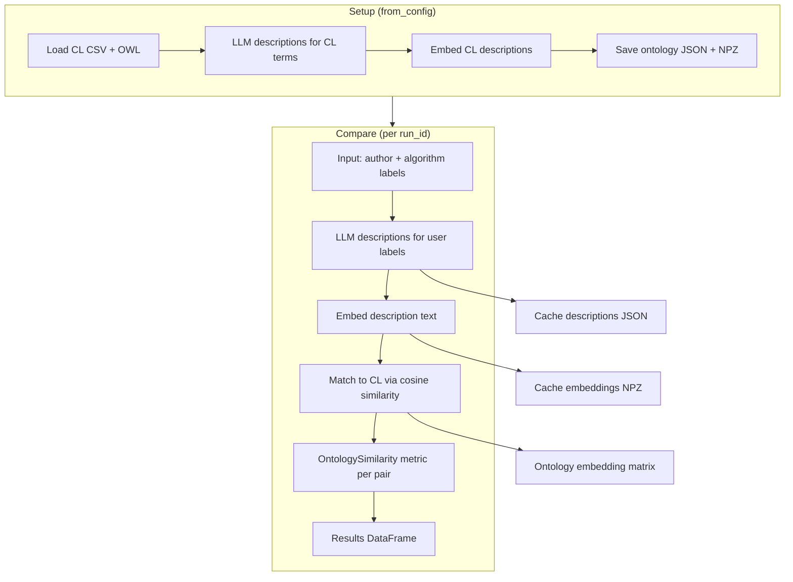
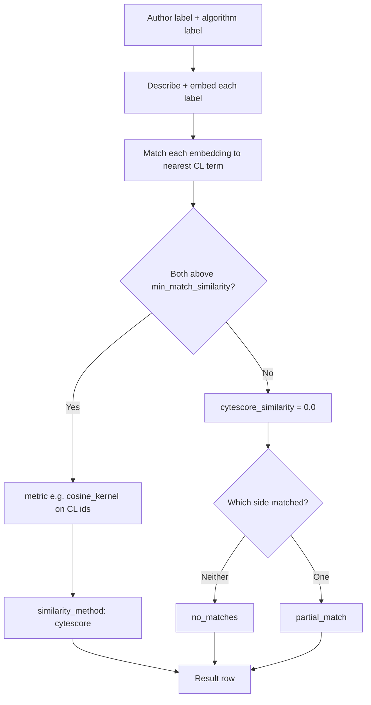

# Workflow

CyteOnto compares parallel lists of cell type labels (author reference vs one or more algorithm predictions) by mapping each label into the [Cell Ontology (CL)](https://obofoundry.org/ontology/cl.html) and scoring pairs with an ontology-aware metric. The implementation lives in the `cyteonto` package; see [cyteonto/README.md](../cyteonto/README.md) for the full API reference.

## End-to-end flow

1. **Setup (once per model pair)** — `await CyteOnto.from_config(agent, embedding, llm)` ensures CL term descriptions and ontology embeddings exist on disk.
2. **Compare (per analysis)** — `await cyto.compare(author_labels, algorithms={...}, run_id=...)` describes and embeds user labels, matches them to CL terms, and scores each author/algorithm pair.
3. **Persist and reuse** — Descriptions (JSON) and embeddings (NPZ) are written under `user_files/` keyed by `run_id`, so reruns with the same labels skip redundant LLM and embedding calls.

## Setup: `from_config`

Runs once when you construct a ready-to-use instance:

1. Verify `cell_ontology/cell_to_cell_ontology.csv` and `cell_ontology/cl.owl` exist under `data_dir`.
2. Load or generate LLM descriptions for every CL term (per text model).
3. Embed those descriptions and save an ontology NPZ (per text + embedding model pair).

If both artifacts already exist and every CL id has a non-blank description, setup returns immediately. Use `force_regenerate=True` to delete and rebuild the ontology cache.

## Compare: `compare`

For each call:

1. **Resolve `run_id`** — Use the value you pass, or an auto-generated `run-<uuid4>` (logged at INFO and stored in every result row).
2. **Author labels** — Load cached descriptions/embeddings when possible; generate missing ones via LLM; embed; save under `user_files/.../<run_id>/author/`.
3. **Match to CL** — Cosine similarity between user embeddings and the precomputed ontology embedding matrix; matches below `min_match_similarity` (default `0.1`) are treated as unmatched (`None`).
4. **Per algorithm** — Repeat describe/embed/cache/match for each algorithm label list (same length as `author_labels`).
5. **Pair scoring** — When both sides have a CL id, `OntologySimilarity.similarity(..., metric=...)` produces `cytescore_similarity` (default metric: `cosine_kernel`). When either side is unmatched, the score is `0.0`.
6. **Results** — A `pandas.DataFrame` with one row per `(algorithm, pair_index)`.

Pass `use_cache=False` to skip on-disk lookups and regenerate everything for that call.

### Result columns

| Column | Meaning |
|--------|---------|
| `run_id` | Namespace used for caches and result tagging |
| `algorithm` | Key from the `algorithms` mapping |
| `pair_index` | Index into the parallel label lists (0-based) |
| `author_label`, `algorithm_label` | Raw input strings |
| `author_ontology_id`, `algorithm_ontology_id` | Best CL match, or `None` if below threshold |
| `author_embedding_similarity`, `algorithm_embedding_similarity` | Cosine similarity to the matched CL embedding |
| `cytescore_similarity` | Score from the chosen metric when both ids exist; else `0.0` |
| `similarity_method` | How the row was classified (see below) |

### `similarity_method` values

| Value | When |
|-------|------|
| `cytescore` | Both labels matched valid `CL:` ids; hierarchy/embedding metric applied |
| `partial_match` | Exactly one side matched the ontology |
| `no_matches` | Neither side matched |
| `string_similarity` | Both ids present but not standard `CL:` prefixes (rare) |

## Run organization

Comparisons are grouped by **`run_id`**, not by a separate “study” concept:

- Reuse the same `run_id` when you rerun with the same labels to hit the cache.
- Use a new `run_id` for a distinct analysis so caches stay isolated.
- Delete artifacts with `cyto.clear_run(run_id)` (optionally scoped to author or a single algorithm).

Identifiers are normalized for paths (`/`, `:`, spaces, `.` replaced) — see [FILE_MANAGEMENT.md](FILE_MANAGEMENT.md).

## Similarity metrics

The default `metric="cosine_kernel"` applies a Gaussian hill on raw embedding cosine between the two matched CL term vectors. Other options include `cosine_direct`, OWL hierarchy metrics (`path`, `set:jaccard`, ...), and `simple` (string fallback on CL id strings). See the metrics table in [cyteonto/README.md](../cyteonto/README.md#similarity-metrics).

Pair-level `cytescore_similarity` is only computed when **both** author and algorithm labels map to CL ids above the match threshold.

## Workflow diagram (overview)

```mermaid
flowchart TD
    subgraph setup ["Setup (from_config)"]
        H["Load CL CSV + OWL"]
        I["LLM descriptions for CL terms"]
        J["Embed CL descriptions"]
        K["Save ontology JSON + NPZ"]
        H --> I --> J --> K
    end

    subgraph compare ["Compare (per run_id)"]
        A["Input: author + algorithm labels"]
        B["LLM descriptions for user labels"]
        C["Embed description text"]
        D["Match to CL via cosine similarity"]
        E["OntologySimilarity metric per pair"]
        F["Results DataFrame"]
        A --> B --> C --> D --> E --> F
    end

    setup --> compare
    B --> B1["Cache descriptions JSON"]
    C --> C1["Cache embeddings NPZ"]
    D --> D1["Ontology embedding matrix"]
```

## Workflow diagram (single label pair)

```mermaid
flowchart TD
    A["Author label + algorithm label"] --> B["Describe + embed each label"]
    B --> C["Match each embedding to nearest CL term"]

    C --> D{"Both above min_match_similarity?"}
    D -->|Yes| E["metric e.g. cosine_kernel on CL ids"]
    D -->|No| F["cytescore_similarity = 0.0"]

    E --> G["similarity_method: cytescore"]
    F --> H{"Which side matched?"}
    H -->|Neither| I["no_matches"]
    H -->|One| J["partial_match"]

    G --> K["Result row"]
    I --> K
    J --> K
```

## AnnData entry point

`compare_anndata` reads algorithm columns from `adata.obs` and delegates to `compare` with the same `run_id` and caching semantics. Author labels are still passed explicitly as a list.

## Related documentation

- [FILE_MANAGEMENT.md](FILE_MANAGEMENT.md) — Directory layout, naming, and cache utilities
- [cyteonto/README.md](../cyteonto/README.md) — Configuration, metrics, storage formats, and extension points
