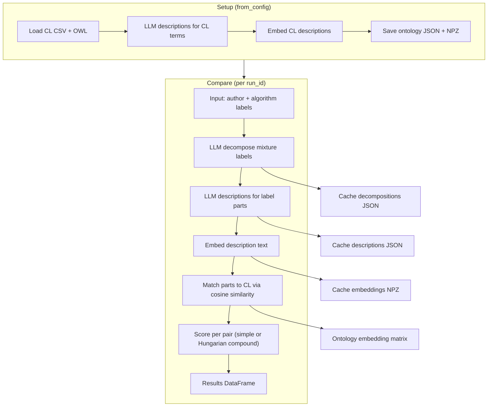
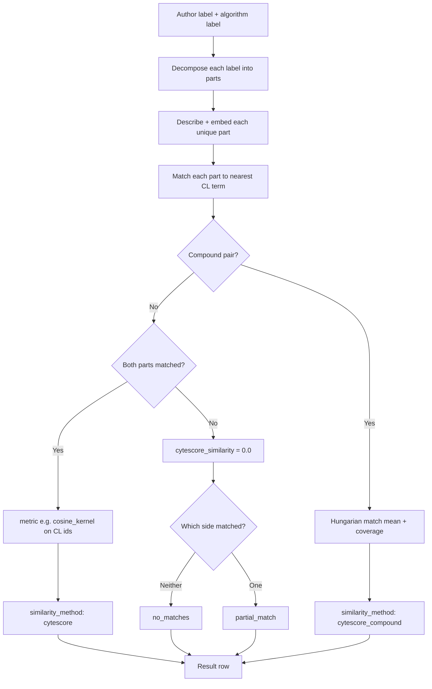

# Workflow

CyteOnto compares parallel lists of cell type labels (author reference vs one or more algorithm predictions) by mapping each label into the [Cell Ontology (CL)](https://obofoundry.org/ontology/cl.html) and scoring pairs with an ontology-aware metric. The implementation lives in the `cyteonto` package; see [cyteonto/README.md](../cyteonto/README.md) for the full API reference.

## End-to-end flow

1. **Setup (once per model pair)** — `await CyteOnto.from_config(agent, embedding, llm)` ensures CL term descriptions and ontology embeddings exist on disk.
2. **Compare (per analysis)** — `await cyto.compare(author_labels, algorithms={...}, run_id=...)` decomposes mixture labels when needed, describes and embeds label parts, matches them to CL terms, and scores each author/algorithm pair.
3. **Persist and reuse** — Descriptions (JSON), embeddings (NPZ), and label decompositions (JSON) are written under `user_files/` keyed by `run_id`, so reruns with the same labels skip redundant LLM calls.

## Setup: `from_config`

Runs once when you construct a ready-to-use instance:

1. Verify `cell_ontology/cell_to_cell_ontology.csv` and `cell_ontology/cl.owl` exist under `data_dir`.
2. Load or generate LLM descriptions for every CL term (per text model).
3. Embed those descriptions and save an ontology NPZ (per text + embedding model pair).

If both artifacts already exist and every CL id has a non-blank description, setup returns immediately. Use `force_regenerate=True` to delete and rebuild the ontology cache.

## Compare: `compare`

For each call:

1. **Resolve `run_id`** — Use the value you pass, or an auto-generated `run-<uuid4>` (logged at INFO and stored in every result row).
2. **Decompose labels** — Unique non-empty labels on each side are passed through `decompose_labels`. Mixture labels (doublets, mixed populations) split into cell-type parts; simple labels map to a single part. Cached under `user_files/decompositions/<run_id>/`.
3. **Describe and embed parts** — Load cached descriptions/embeddings when possible; generate missing ones via LLM; embed unique parts; save under `user_files/.../<run_id>/author/` and per-algorithm paths.
4. **Match to CL** — Cosine similarity between part embeddings and the precomputed ontology embedding matrix. Matches below `min_match_similarity` (default `0.1`) are treated as unmatched (empty ontology id).
5. **Per algorithm** — Repeat decompose/describe/embed/cache/match for each algorithm label list (same length as `author_labels`).
6. **Pair scoring** — For each aligned index:
   - **Simple pair** (one part on each side): `OntologySimilarity.similarity(...)` when both parts matched; otherwise `0.0` with `partial_match` or `no_matches`.
   - **Compound pair** (more than one part on either side): build an m×n cytescore matrix, Hungarian max-weight matching, mean of assigned scores; multiply by `min(m,n)/max(m,n)` when `m ≠ n`; `similarity_method = cytescore_compound`.
   - **Empty labels**: both empty → `empty`; one empty → non-empty side keeps ontology fields, score `0.0`, `similarity_method = empty`.
7. **Results** — A `pandas.DataFrame` with one row per `(algorithm, pair_index)`.

Pass `use_cache=False` to skip on-disk lookups and regenerate everything for that call.

### Result columns

| Column | Meaning |
|--------|---------|
| `run_id` | Namespace used for caches and result tagging |
| `algorithm` | Key from the `algorithms` mapping |
| `pair_index` | Index into the parallel label lists (0-based) |
| `author_label`, `algorithm_label` | Raw input strings |
| `author_ontology_id`, `algorithm_ontology_id` | Best CL match per part; semicolon-separated for compound pairs (matched assignment only). Empty string if unmatched. |
| `author_ontology_name`, `algorithm_ontology_name` | Primary CSV label (or OWL fallback) for each id above |
| `author_embedding_similarity`, `algorithm_embedding_similarity` | Mean cosine similarity of parts to their CL matches |
| `cytescore_similarity` | Score from the chosen metric when applicable; else `0.0` |
| `similarity_method` | How the row was classified (see below) |

### `similarity_method` values

| Value | When |
|-------|------|
| `cytescore` | Simple pair; both parts matched valid `CL:` ids; hierarchy/embedding metric applied |
| `cytescore_compound` | Compound pair; Hungarian match mean (with coverage penalty when part counts differ) |
| `partial_match` | Exactly one side matched the ontology |
| `no_matches` | Neither side matched |
| `string_similarity` | Both ids present but not standard `CL:` prefixes (rare) |
| `empty` | One or both raw labels are empty |

### Compound scoring (summary)

When either side has more than one part after decomposition:

1. Score every author-part vs algorithm-part pair with the chosen `metric`.
2. Select `k = min(m,n)` assignments that maximize total score (Hungarian algorithm).
3. `match_mean` = mean of the `k` assigned scores.
4. If `m ≠ n`, multiply by coverage `min(m,n) / max(m,n)`.
5. Ontology ids and names in the result list only the matched pairs.

See `notebooks/quick_tutorial.ipynb` for worked examples (2×2 same compound ~1.0, 3×2 partial overlap ~0.35).

## Run organization

Comparisons are grouped by **`run_id`**, not by a separate “study” concept:

- Reuse the same `run_id` when you rerun with the same labels to hit the cache.
- Use a new `run_id` for a distinct analysis so caches stay isolated.
- Delete embeddings and descriptions with `cyto.clear_run(run_id)` (optionally scoped to author or a single algorithm). Decomposition JSON under `decompositions/<run_id>/` is separate; remove it manually if needed.

Identifiers are normalized for paths (`/`, `:`, spaces, `.` replaced) — see [FILE_MANAGEMENT.md](FILE_MANAGEMENT.md).

## Similarity metrics

The default `metric="cosine_kernel"` applies a Gaussian hill on raw embedding cosine between the two matched CL term vectors. Other options include `cosine_direct`, OWL hierarchy metrics (`path`, `set:jaccard`, ...), and `simple` (string fallback on CL id strings). See the metrics table in [cyteonto/README.md](../cyteonto/README.md#similarity-metrics).

For simple pairs, `cytescore_similarity` requires both parts to map to CL ids above the match threshold. Compound pairs use the Hungarian path described above.

## Workflow diagram (overview)

```mermaid
flowchart TD
    subgraph setup ["Setup (from_config)"]
        H["Load CL CSV + OWL"]
        I["LLM descriptions for CL terms"]
        J["Embed CL descriptions"]
        K["Save ontology JSON + NPZ"]
        H --> I --> J --> K
    end

    subgraph compare ["Compare (per run_id)"]
        A["Input: author + algorithm labels"]
        D0["LLM decompose mixture labels"]
        B["LLM descriptions for label parts"]
        C["Embed description text"]
        D["Match parts to CL via cosine similarity"]
        E["Score per pair (simple or Hungarian compound)"]
        F["Results DataFrame"]
        A --> D0 --> B --> C --> D --> E --> F
    end

    setup --> compare
    D0 --> D0a["Cache decompositions JSON"]
    B --> B1["Cache descriptions JSON"]
    C --> C1["Cache embeddings NPZ"]
    D --> D1["Ontology embedding matrix"]
```

## Workflow diagram (single label pair)

```mermaid
flowchart TD
    A["Author label + algorithm label"] --> B["Decompose each label into parts"]
    B --> C["Describe + embed each unique part"]
    C --> D["Match each part to nearest CL term"]

    D --> E{"Compound pair?"}
    E -->|No| F{"Both parts matched?"}
    F -->|Yes| G["metric e.g. cosine_kernel on CL ids"]
    F -->|No| H["cytescore_similarity = 0.0"]
    G --> I["similarity_method: cytescore"]
    H --> J{"Which side matched?"}
    J -->|Neither| K["no_matches"]
    J -->|One| L["partial_match"]

    E -->|Yes| M["Hungarian match mean + coverage"]
    M --> N["similarity_method: cytescore_compound"]

    I --> O["Result row"]
    K --> O
    L --> O
    N --> O
```

## AnnData entry point

`compare_anndata` reads algorithm columns from `adata.obs` and delegates to `compare` with the same `run_id` and caching semantics. Author labels are still passed explicitly as a list.

## Related documentation

- [FILE_MANAGEMENT.md](FILE_MANAGEMENT.md) — Directory layout, naming, and cache utilities
- [cyteonto/README.md](../cyteonto/README.md) — Configuration, metrics, storage formats, and extension points
