# Workflow

## Main Workflow

The CyteOnto workflow consists of several interconnected processes that work together to provide accurate cell type annotation comparisons.

## Detailed Process Flow

### 1. Initial Setup Process

The setup process runs once to prepare the Cell Ontology knowledge base:

1. **Load Cell Ontology**: Parse the CSV file containing Cell Ontology terms
2. **Generate Descriptions**: Use LLM to create textual descriptions for each ontology term. The LLM generates a descriptive name, function of cell, marker genes, disease relevance and developmental stage text.
3. **Create Embeddings**: Generate semantic embeddings for all ontology descriptions
4. **Cache Results**: Store descriptions and embeddings for future use

### 2. User Data Processing

For each comparison request:

1. **Input Processing**: Accept author labels and algorithm predictions
2. **Description Generation**: Generate descriptions for user labels using LLM
3. **Embedding Creation**: Generate embedding vectors for user labels
4. **Ontology Matching**: Find best matching Cell Ontology terms
5. **Similarity Calculation**: Compute hierarchical similarity using ontology structure
6. **Results Compilation**: Format results into structured output

### 3. Study Organization

Data is organized by study to enable:
- Clean separation between different datasets
- Reproducible analyses
- Caching and retrieval

### 4. Similarity Calculation

Compute final similarity between author and algorithm labels

**Methods Used**:

1. **Ontology Hierarchy Similarity** (Primary):
   - Both labels map to valid Cell Ontology terms
   - Use ontology graph structure to compute semantic distance
   - Consider parent-child relationships, common ancestors
   - Normalized score between 0 and 1

2. **String Similarity** (Fallback):
   - Used when one or both labels lack ontology matches
   - Employs Python's `SequenceMatcher` for text comparison
   - Provides basic similarity measure

3. **Partial Match**:
   - Only one label has ontology match
   - Limited similarity information available

4. **No Matches**:
   - Neither label matches ontology terms
   - No meaningful similarity can be computed

## Workflow Diagram (Overview)

```mermaid
flowchart TD
    A["📊 Input: Cell Labels"] --> B["🤖 LLM Description Generation"]
    B --> C["📐 Embedding Generation"]
    C --> D["🎯 Ontology Matching"]
    D --> E["🧮 Similarity Calculation"]
    E --> F["📈 Results & Analysis"]
    
    B --> B1["💾 Cache Descriptions<br/>(JSON)"]
    C --> C1["💾 Cache Embeddings<br/>(NPZ)"]
    D --> D1["🔗 Cell Ontology<br/>(OWL)"]
    
    G["⚙️ Setup Process"] --> H["📚 Load Cell Ontology"]
    H --> I["🤖 Generate Descriptions<br/>for All CL Terms"]
    I --> J["📐 Create Embeddings<br/>for All CL Terms"] 
    J --> K["💾 Save Base Cache"]
    
    L["🏥 Study Organization"] --> M["📁 study1/"]
    L --> N["📁 study2/"]
    L --> O["📁 study3/"]
    M --> M1["📂 author/"]
    M --> M2["📂 algorithms/"]
    N --> N1["📂 author/"]
    N --> N2["📂 algorithms/"]
    
    style A fill:#e1f5fe
    style F fill:#e8f5e8
    style G fill:#fff3e0
    style L fill:#f3e5f5
```

## Workflow Diagram (Label Comparision)

